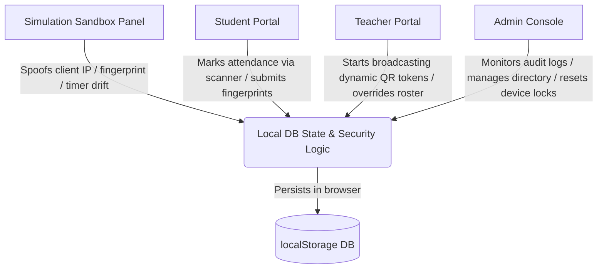

# 🛡️ Roster-Gate: Secure Attendance Tracking System

Roster-Gate is a security-hardened academic attendance tracking web application built to prevent attendance fraud (cheating) in university classrooms. It implements multi-layered security verification protocols, including **Dynamic QR Codes (5-second TTL)**, **Hardware-bound Device Fingerprinting**, and **WiFi Subnet Restrictions**.

The project is built as a fully-simulated, standalone full-stack React + Tailwind CSS v4 prototype. It features a real-time **Security Sandbox Control Panel** that lets you simulate attacks (spoofing IP, changing fingerprints, causing clock drift) to demonstrate the system's defensive mechanisms.

---

## 📐 System Architecture

Roster-Gate's architecture divides responsibilities across individual client components, a simulated database layer, and a live threat sandbox:



### File Map
*   **[`db.js`](file:///home/Beetle/college%20proj/attendance-webapp/src/state/db.js)**: The core state machine and validation engine. Houses functions for browser fingerprinting, cryptographic dynamic QR token generation, and the multi-layered security validation rules.
*   **[`App.jsx`](file:///home/Beetle/college%20proj/attendance-webapp/src/App.jsx)**: Main layout coordinator. Renders the top JUNO branding banners, sub-navigation tabs, and routes the active user.
*   **[`StudentDashboard.jsx`](file:///home/Beetle/college%20proj/attendance-webapp/src/components/StudentDashboard.jsx)**: Handles device fingerprint enrollment, simulated camera scanning viewfinder, and personal attendance history cards.
*   **[`TeacherDashboard.jsx`](file:///home/Beetle/college%20proj/attendance-webapp/src/components/TeacherDashboard.jsx)**: Allows starting classroom sessions, renders the dynamic QR canvas with a shrinking 5-second countdown timer, displays historical analytics trends, and hosts the live roster grid.
*   **[`AdminDashboard.jsx`](file:///home/Beetle/college%20proj/attendance-webapp/src/components/AdminDashboard.jsx)**: Displays real-time security intrusion logs, divides users into separate Student and Teacher directories, and permits clearing bound device keys.
*   **[`SimulationPanel.jsx`](file:///home/Beetle/college%20proj/attendance-webapp/src/components/SimulationPanel.jsx)**: Floating tool shelf allowing reviewers to alter system variables (like spoofing IP addresses or system clocks) to simulate fraud.

---

## 🔒 Core Security Defenses & How They Work

Roster-Gate employs a three-tier validation check before marking any student present:

### 1. Account Sharing Prevention: Device Fingerprint Binding
*   **How it works**: When a student registers their device, the system extracts a set of hardware variables (Screen dimensions, CPU concurrency core limits, browser user-agent details, language settings, and Canvas rendering engine signatures) to generate a unique hash.
*   **The Defense**: This hash is bound to the student's database profile. From that point on, a student can **only** mark attendance from that specific device. If they share their credentials with a classmate, the classmate's device fingerprint will mismatch, blocking entry.
*   **Admin Override**: If a student gets a new phone, a system administrator must manually click "Clear Bind" to unlock their profile for a new device pairing.

### 2. Location Spoofing Prevention: WiFi Subnet Whitelisting
*   **How it works**: Every classroom course is associated with a specific local WiFi IP range (e.g., `192.168.1.*` for Classroom LH-101).
*   **The Defense**: When marking attendance, the app verifies the student's IP address. If the student is checking in remotely (from a home network, cell data, or VPN), the system rejects the request and logs a critical subnet violation warning in the audit logs.

### 3. Screenshot Sharing Prevention: 5-Second Dynamic QR Code TTL
*   **How it works**: The teacher dashboard generates a Base64-encrypted token payload containing the `sessionID`, a precise `unixTimestamp` synced to the simulated database, and a random cryptographic salt. This token rotates to form a new QR code **every 5 seconds**.
*   **The Defense**: If a student takes a screenshot of the QR code and shares it with absent friends, the shared QR code token will expire within 5 seconds. When the absent friend scans the old token, the validation engine detects that the timestamp has expired and blocks the request as a screenshot replay attack.

---

## 🛠️ Step-by-Step Security Demo Scenarios

Open the application on your browser and follow these step-by-step routines to demonstrate the security features:

### Scenario A: Normal Verification Flow (Happy Path)
1.  Log in as **Dr. Alan Turing** (Teacher).
2.  In **QR Broadcast Controls**, select **CS-101** and click **Start Attendance Broadcast**. A dynamic QR code begins to rotate.
3.  Log out and log in as **Alice Smith** (Student).
4.  Open the **Simulation Panel** on the right side and ensure:
    *   IP is set to **Classroom Wi-Fi** (`192.168.1.45`).
    *   System Clock Offset is set to **Sync (0s)**.
5.  In the Student portal, click **Link Device Fingerprint** to bind Alice's profile.
6.  Open **Class Attendance Scanner** and click **Capture Camera Scan**.
7.  **Result**: Attendance is verified successfully. If you log back into Dr. Turing's dashboard, Alice will be marked as **Present** in the live roster grid.

---

### Scenario B: Blocking Remote Students (Location Spoof Attack)
1.  Log in as **Alice Smith** (Student).
2.  Open the **Simulation Panel** and change the simulated IP to **Home Network** (`73.12.84.10`).
3.  Click **Capture Camera Scan** inside the scanner viewfinder.
4.  **Result**: Rejected! *"Access Denied: Classroom Network Mismatch. Please connect to the class Wi-Fi."*
5.  Log in as **Admin** and check the **Security Audit Logs** card:
    > `[CRITICAL] Cheating Flagged: Location Subnet Mismatch for Alice Smith (Client IP: 73.12.84.10, Classroom Subnet: 192.168.1.*)`

---

### Scenario C: Blocking Screenshot Replays (Timer Drift Attack)
1.  Log in as **Dr. Alan Turing** (Teacher). Copy the active raw token string from the sniffer diagnostics feed.
2.  Log in as **Alice Smith** (Student).
3.  Open the **Simulation Panel** and set the Clock Offset to **+10 seconds** (simulating scanning a screenshot taken 10 seconds ago).
4.  Paste the copied token string into the student's manual payload input box and click **Inject Token**.
5.  **Result**: Rejected! *"Access Denied: Expired QR Code (Screenshot sharing or delayed scanning detected)."*
6.  The Admin audit logs will capture the event:
    > `[CRITICAL] Cheating Flagged: Expired QR Scan / Screenshot sharing by Alice Smith`

---

### Scenario D: Blocking Account Sharing (Fingerprint Attack)
1.  Open the **Simulation Panel** and check **Spoof Device Fingerprint** (simulating logging in on a classmate's phone).
2.  Try to log in as **Alice Smith** (Student).
3.  **Result**: Blocked immediately at login! *"Access Denied! Device Fingerprint Mismatch."* (Alice's profile is locked to her actual hardware signature).

---

## ⚡ Tech Stack & Installation

*   **Frontend**: React 19 + Vite 8
*   **Styling**: Tailwind CSS v4 (configured via `@tailwindcss/vite` compiler plugin)
*   **Charts**: Recharts (for live attendance ratio feeds)
*   **Icons**: Lucide React
*   **State**: LocalStorage client-side persistence

### Installation & Run

1. Install dependencies:
```bash
npm install
```

2. Start the hot-reloading Vite dev server:
```bash
npm run dev
```

3. Compile a production build:
```bash
npm run build
```
